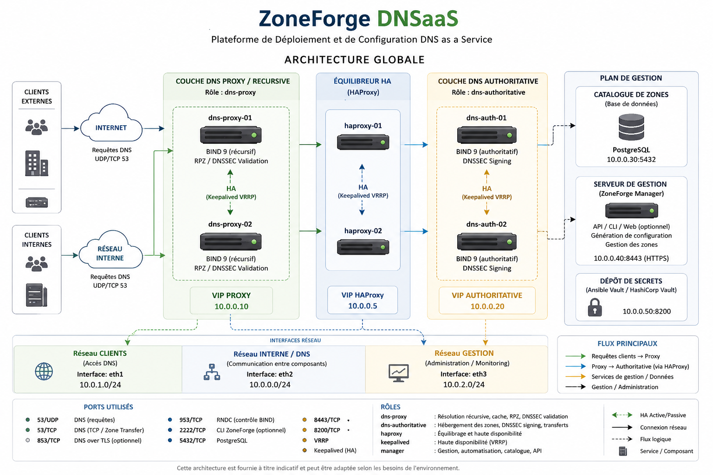

## v12.1.0 - Manager API & Node Lifecycle

- Added Manager API lifecycle foundation.
- Added persistent JSON node inventory backend.
- Added node registration tokens and status lifecycle.
- Added DNSSync dry-run/apply/rollback workflow modes.
- Added DNSBeat node health status fields.
- Added RBAC admin/operator/viewer roles.

# DNSForge

> Plateforme de Déploiement et de Configuration DNS as a Service

[Documentation](./docs/index.md) · [Architecture](#architecture) · [Fonctionnalités](#fonctionnalités) · [Sécurité](#sécurité)

---

## Présentation

DNSForge est une plateforme de déploiement, de configuration et d'exploitation DNS destinée aux environnements entreprise.

Elle permet de construire, sécuriser, automatiser et exploiter des infrastructures DNS modernes basées sur BIND 9, avec une approche orientée **DNS as a Service**, **Infrastructure as Code**, haute disponibilité, conformité et gouvernance DNS.

Le README présente le produit. La documentation détaillée de déploiement, d'exploitation, de sécurité, de troubleshooting et de référence est centralisée dans [docs/index.md](./docs/index.md).

---

## Fonctionnalités

### Services DNS

- DNS Authoritative basé sur BIND 9.
- DNS Proxy / Recursive.
- Split-Horizon DNS.
- Multi-cluster authoritative.
- Multi-VIP.
- Haute disponibilité avec Keepalived.
- Catalogue centralisé des zones.
- Gestion des zones via le CLI `dnsforge zone`.

### Sécurité DNS

- DNSSEC.
- TSIG pour les transferts de zones.
- RNDC avec génération automatique du secret si absent.
- RPZ / DNS Firewall sur les services récursifs.
- Blocage de RPZ sur les nœuds authoritative.
- Validation stricte des settings avant rendu et déploiement.

### Automatisation

- Génération automatisée des configurations BIND.
- Déploiement automatisé des rôles DNS Proxy et DNS Authoritative.
- Production Gate.
- Monitoring natif et healthchecks.
- Tests de conformité.
- Génération de la référence CLI réelle via `dnsforge generate commands-doc`.

---

## Architecture



DNSForge sépare clairement les rôles DNS récursifs/proxy et autoritatifs :

| Composant | Rôle |
|---|---|
| `dns-proxy` | Résolution récursive, cache, RPZ, filtrage, accès clients |
| `dns-authoritative` | Publication des zones, transferts TSIG, DNSSEC, VIP authoritative |
| `dnsforge zone` | Gestion des zones : create, read, update, disable, enable, delete, history, diff, rollback |
| `settings/` | Paramètres par nœud et par rôle |
| `catalog/zones.yml` | Source de vérité des zones DNS |
| `tests/` | Contrôles de conformité, sécurité et rendu |

Pour les détails d'architecture, consulter [docs/ARCHITECTURE.md](./docs/ARCHITECTURE.md).

---

## Cas d'utilisation

DNSForge est adapté aux contextes suivants :

- entreprise multi-sites ;
- datacenters privés ;
- cloud privé ;
- fournisseur de services managés ;
- environnement DNS critique ;
- plateforme interne DNS as a Service ;
- segmentation DNS interne, externe et partenaire ;
- exploitation standardisée de BIND 9.

---

## Sécurité

DNSForge applique une séparation stricte des responsabilités :

```text
dns-proxy         : RPZ autorisé
dns-recursive     : RPZ autorisé
dns-authoritative : RPZ interdit
```

Les serveurs autoritatifs publient les données de référence. Les politiques de filtrage RPZ sont réservées aux services récursifs/proxy.

Voir :

- [Sécurité](./docs/SECURITY.md)
- [RPZ — DNS Firewall](./docs/SECURITY/RPZ.md)
- [Validation stricte des settings](./docs/SETTINGS-VALIDATION.md)

---

## Documentation

Le point d'entrée documentaire est :

[docs/index.md](./docs/index.md)

La documentation est organisée par contexte :

- présentation ;
- déploiement ;
- exploitation ;
- sécurité ;
- référence.

---

## Authors

Alfred TCHONDJO

Project Initiator — IRIVEN Group

---

## Copyright

© IRIVEN Group — All Rights Reserved


## Installation système

```bash
sudo ./install/install.sh --profile proxy-forwarder
sudo ./install/install.sh --profile proxy-hybrid
sudo ./install/install.sh --profile authoritative
```

Voir `docs/INSTALLATION.md`.

## Node configuration governance

After editing `/etc/dnsforge/setup.conf`, use the controlled configuration lifecycle:

```bash
sudo dnsforge config validate
sudo dnsforge config diff
sudo dnsforge config apply --reason "Describe the approved change"
sudo dnsforge config history
sudo dnsforge config rollback --id 1 --reason "Rollback approved change"
sudo dnsforge audit config
```

`setup.conf` remains the source of truth for the node. `dnsforge initialize` is still one-shot; later changes are applied through `dnsforge config apply`.

## CI / Quality gates

DNSForge CI is blocking and runs on Python 3.9, 3.11 and 3.13.

The pipeline enforces Ruff, mypy, pytest, coverage, Bandit, pip-audit, wheel build/install, and generated BIND configuration validation. In GitHub Actions, skipped tests are forbidden; local runs may skip BIND validation only when BIND tools are not installed.


## Catalog Zones

DNSForge 10.9 introduces Enterprise catalog zone governance.

```bash
sudo dnsforge catalog status
sudo dnsforge catalog enable --reason "Enable catalog publication"
sudo dnsforge catalog sync --reason "Publish active authoritative zones"
sudo dnsforge catalog list
sudo dnsforge catalog validate
sudo dnsforge audit catalog
```

Catalog sync publishes active eligible zones from the DNSForge zone catalog and writes the generated catalog zone into the native BIND layout for the current distribution.
## Authoritative Cluster Sync

```bash
sudo dnsforge cluster peers
sudo dnsforge cluster diff
sudo dnsforge cluster sync --dry-run --reason "Review authoritative sync"
sudo dnsforge cluster sync --reason "Apply authoritative sync"
```

Cluster sync is authoritative-only. Proxy nodes consume authoritative VIP/IP endpoints but are not HA cluster members.


## Release archive packaging

DNSForge release archives include the built wheel and source archive under `dist/`.
The repository itself must remain free of caches, build directories and egg metadata.

```bash
sudo python tools/clean.py --fix
python tools/clean.py --check-source
python -m build
sudo python tools/clean.py --fix-release
python tools/clean.py --check-release
```

Install from a release archive:

```bash
sudo ./install/install.sh --profile authoritative
sudo dnsforge initialize --render-only
sudo dnsforge initialize --apply
```

### DNSForge v11.1.1 Catalog Self-Healing

DNSForge v11.1.1 adds controlled catalog zone self-healing through `dnsforge catalog repair`. The command reconciles the catalog state against active authoritative zones, adds missing catalog members, removes stale publications, and rewrites the generated catalog zone file.

### DNSForge v11.1.0 Production Readiness

This release introduces production-readiness foundations: a reusable filesystem transaction manager, real BIND validation hooks, cluster audit, per-zone integrity audit, disaster recovery snapshot/restore/verify commands, and an internal application API facade for future DNSForge Manager integration.

Key commands:

```bash
dnsforge cluster audit
dnsforge audit zone <zone>
dnsforge disaster snapshot --reason "planned recovery checkpoint"
dnsforge disaster verify --snapshot <path>
dnsforge disaster restore --snapshot <path> --dry-run
```


### DNSForge v11.1.2 Cluster Consistency Hardening

DNSForge v11.1.2 strengthens `dnsforge cluster audit` for production automation. The command now emits a structured consistency report covering peer manifests, zone counts, catalog serial visibility, DNSSEC alignment, zone checksums, SOA serial checksums and critical drift.

Text output remains the default:

```bash
dnsforge cluster audit
```

Machine-readable output is available for pipelines and external monitoring:

```bash
dnsforge cluster audit --format json
```

Critical findings return a non-zero exit code. Warnings are reported without failing the command, which allows operators to distinguish production blockers from advisory drift.


### DNSForge v11.2.0 API Foundation

DNSForge v11.2.0 introduces stable internal API facades for zones, DNSSEC, catalog zones, cluster operations and disaster recovery. It also adds a synchronous EventBus plus append-only AuditEventRepository to prepare DNSForge Manager, DNSBeat and DNSSync without forcing future components to parse CLI output.

Selected commands now support structured JSON output, including `dnsforge status --format json`, `dnsforge zone list --format json`, `dnsforge catalog status --format json` and `dnsforge catalog list --format json`.


### DNSForge v11.2.2 Release Hardening

DNSForge v11.2.2 strengthens the release chain after the CLI/API parity guard. The release gate now verifies version synchronization, generated command documentation, distribution artifact naming, and absence of generated caches inside shipped artifacts. A pre-commit configuration is included for local Ruff formatting/linting and source release checks.

### DNSForge v11.2.1 CLI/API Parity Guard

DNSForge v11.2.1 formalizes the rule that the local `dnsforge` CLI remains mandatory on every installed server, even after API and Manager integration. The API is an additional integration surface; no feature may become API-only or GUI-only. Release tests now protect the top-level CLI domains and ensure the CLI dispatcher does not depend on `dnsforge.api` for local execution.


### DNSForge v11.4.0 Secure CLI / Build Tool Separation

DNSForge keeps the security rule that every CLI command requires elevated privileges except `dnsforge version`. Build and CI documentation generation uses `tools/generate_commands_doc.py` instead of invoking `dnsforge generate commands-doc`, so the local CLI security model remains intact.

### DNSForge v11.3.1 Sync Consolidation

DNSForge v11.3.1 removes the duplicate `sync_foundation` package and consolidates sync provider boundaries under the existing `sync` application module. The CLI remains unchanged: `dnsforge sync providers`.

### DNSForge v11.3.0 Enterprise Operations

DNSForge v11.3.0 introduces production operations foundations while preserving full local CLI administration on every installed server. It adds a local job engine foundation, health scoring, unified operational reporting, configuration drift detection, audit event tailing, metrics collection, sync provider boundaries for future DNSSync, and DNSSEC policy management. These features are implemented as application services and exposed through the CLI without requiring DNSForge Manager or an HTTP API.

```bash
dnsforge job list
dnsforge health score
dnsforge report generate --format json
dnsforge drift audit
dnsforge events tail
dnsforge metrics show
dnsforge sync providers
dnsforge dnssec policy show
```


### DNSForge v11.4.0 Product Hardening & Contract Stabilization

This release freezes DNS feature growth and adds measurable product gates: CLI coverage, API coverage, event coverage, service coverage and release hygiene. It also introduces public contracts for future DNSForge Manager integration while keeping every local CLI command available on each installed server. All CLI commands continue to require elevated privileges except `dnsforge version`.

## DNSForge Manager boundary

DNSForge Manager is a central management plane for one or more DNSForge agents. It may run on a host without BIND installed. DNSBeat and DNSSync are Manager sub-modules; they observe and orchestrate through DNSForge agents, while DNSForge remains the only component that deploys or modifies local BIND configuration.
